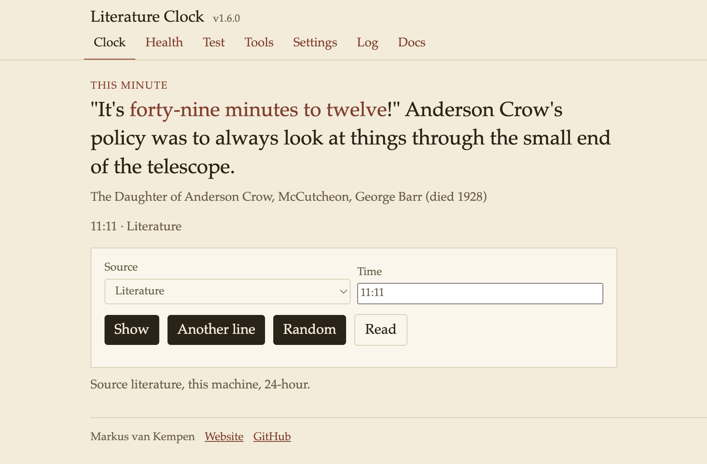
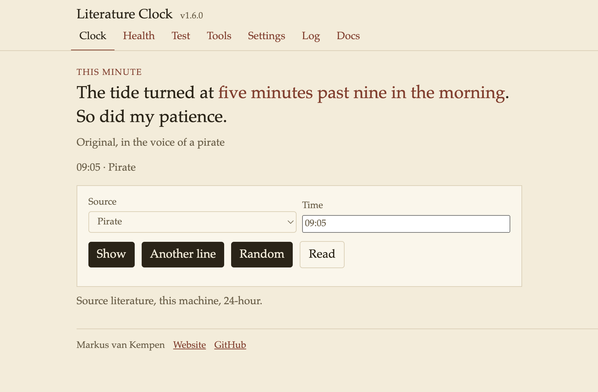
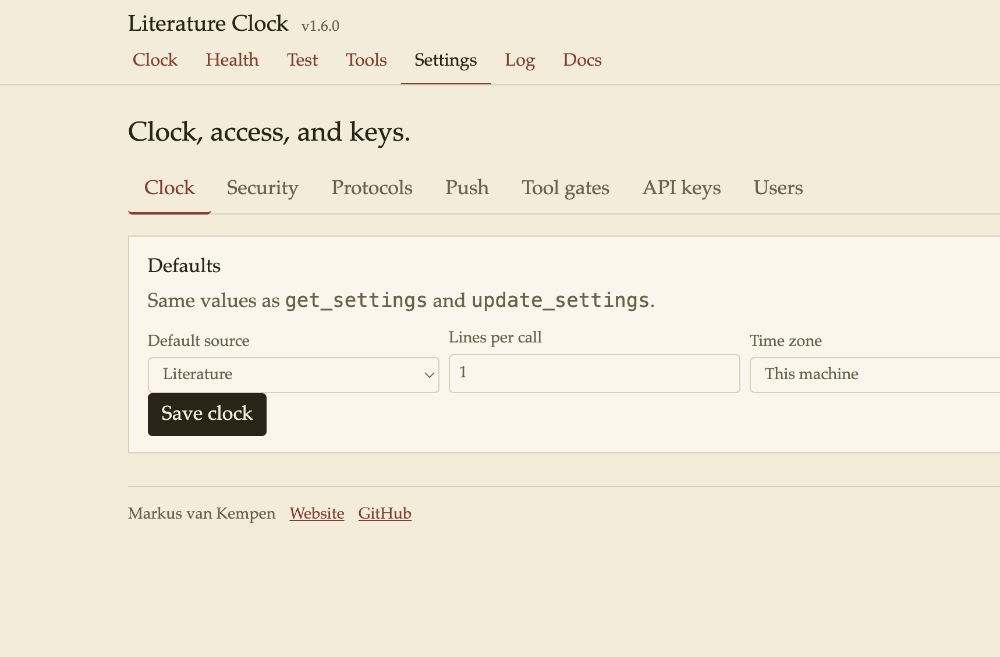
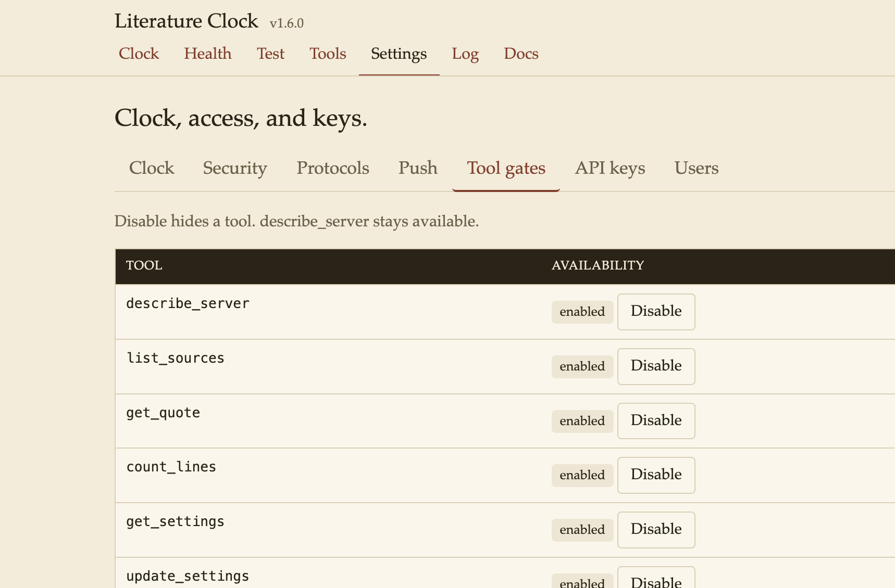
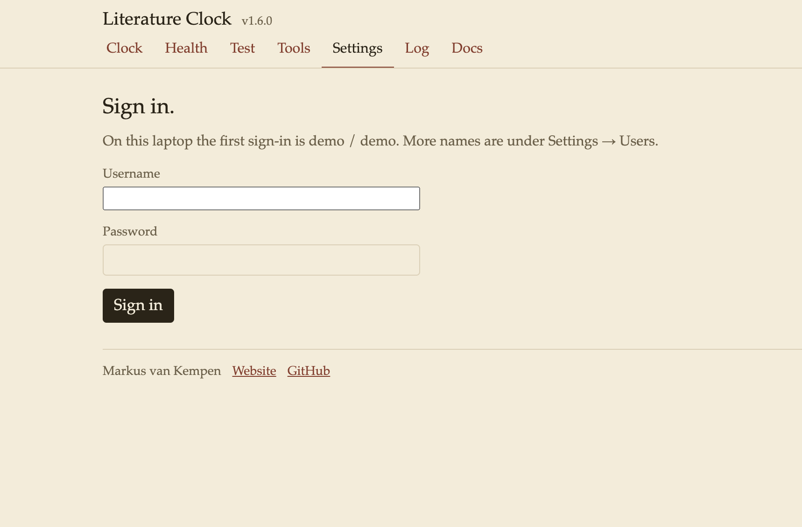

<meta name="description" content="A line for the current minute, from literature, copyright-free books, or an original voice.">
<meta name="keywords" content="mcp, model-context-protocol, mcp-server, literature-clock, ink-clock, quotes, books, voices, stdio, streamable-http, cursor, vscode, claude, clock">
<meta property="og:title" content="Literature Clock MCP">
<meta property="og:description" content="A line for the current minute, from literature, copyright-free books, or an original voice.">
<meta property="og:image" content="https://raw.githubusercontent.com/markusvankempen/literature-clock-mcp/main/docs/icon.png">
<meta property="og:type" content="website">
<meta property="og:url" content="https://github.com/markusvankempen/literature-clock-mcp">
<meta name="twitter:card" content="summary">
<meta name="twitter:title" content="Literature Clock MCP">
<meta name="twitter:description" content="A line for the current minute, from literature, copyright-free books, or an original voice.">
<meta name="twitter:image" content="https://raw.githubusercontent.com/markusvankempen/literature-clock-mcp/main/docs/icon.png">

<p align="center">
  
</p>

<h1 align="center">Literature Clock MCP</h1>

<p align="center">
  A line for the current minute, from literature, copyright-free books, or an original voice.
</p>

<p align="center">
  This repository is the project home: listing, screenshots, and how to connect. The server and the quote files ship in the npm package <a href="https://www.npmjs.com/package/literature-clock-mcp">literature-clock-mcp</a>. They are not in this git tree.
</p>

<p align="center">
  <a href="https://www.npmjs.com/package/literature-clock-mcp"></a>
  <a href="LICENSE"></a>
  <a href="https://www.npmjs.com/package/literature-clock-mcp"></a>
  <a href="https://modelcontextprotocol.io"></a>
  <a href="https://creativecommons.org/licenses/by-nc-sa/2.5/"></a>
</p>

<p align="center">
  <a href="https://www.npmjs.com/package/literature-clock-mcp"></a>
  <a href="https://github.com/markusvankempen/literature-clock-mcp"></a>
  <a href="https://github.com/cursor/cursor"></a>
  <a href="https://code.visualstudio.com/docs/copilot/customization/mcp-servers"></a>
  <a href="https://modelcontextprotocol.io"></a>
</p>

<p align="center">
  <code>mcp</code>
  <code>model-context-protocol</code>
  <code>mcp-server</code>
  <code>literature-clock</code>
  <code>ink-clock</code>
  <code>quotes</code>
  <code>books</code>
  <code>voices</code>
  <code>stdio</code>
  <code>streamable-http</code>
  <code>cursor</code>
  <code>vscode</code>
  <code>claude</code>
</p>

## Add the server

**Cursor** — `~/.cursor/mcp.json`

```json
{
  "mcpServers": {
    "literature-clock-mcp": {
      "command": "npx",
      "args": ["-y", "literature-clock-mcp"]
    }
  }
}
```

**VS Code** — user or workspace `mcp.json`

```json
{
  "servers": {
    "literature-clock-mcp": {
      "type": "stdio",
      "command": "npx",
      "args": ["-y", "literature-clock-mcp"]
    }
  }
}
```

**Claude Desktop** — `~/Library/Application Support/Claude/claude_desktop_config.json` on macOS, `%APPDATA%\Claude\claude_desktop_config.json` on Windows

```json
{
  "mcpServers": {
    "literature-clock-mcp": {
      "command": "npx",
      "args": ["-y", "literature-clock-mcp"]
    }
  }
}
```

Install with `npx literature-clock-mcp`. That process is stdio. `MCP_MODE=http npx literature-clock-mcp` serves the clock.

## Add a hosted server

The same configs work for [Render](https://literature-clock-mcp.onrender.com/), IBM Code Engine, or any host that serves this app over HTTPS. The MCP URL is the site plus `/mcp`. The live Render server is `https://literature-clock-mcp.onrender.com/mcp`. A Code Engine app looks like `https://<app>.<region>.codeengine.appdomain.cloud/mcp`.

The host must run `MCP_MODE=http HOST=0.0.0.0 node src/index.js` and leave `PORT` for the platform. Deploy steps for Render are under [Render](#render).

When auth mode is `write` or `all`, add a header `Authorization: Bearer <key>`. Auth is `off` on a fresh server, so the blocks below need no key.

**Cursor** — this project: `.cursor/mcp.json`. Every project: `~/.cursor/mcp.json`.

```json
{
  "mcpServers": {
    "literature-clock-mcp": {
      "url": "https://literature-clock-mcp.onrender.com/mcp"
    }
  }
}
```

Save the file. Open **Cursor Settings → MCP** and turn **literature-clock-mcp** on. A green dot means the handshake worked. In Agent chat, ask: `ask literature-clock-mcp for the current quote`.

**VS Code** — workspace `.vscode/mcp.json`, or Command Palette → **MCP: Open User Configuration**.

```json
{
  "servers": {
    "literature-clock-mcp": {
      "type": "http",
      "url": "https://literature-clock-mcp.onrender.com/mcp"
    }
  }
}
```

Command Palette → **MCP: List Servers** → start **literature-clock-mcp**. In Copilot Chat, confirm the server is selected in the tools list, then ask for the current quote.

**Claude Desktop** — the desktop file only starts a local process. `mcp-remote` opens the hosted URL. Config path: `~/Library/Application Support/Claude/claude_desktop_config.json` on macOS, `%APPDATA%\Claude\claude_desktop_config.json` on Windows. Quit Claude and open it again after you save.

```json
{
  "mcpServers": {
    "literature-clock-mcp": {
      "command": "npx",
      "args": ["-y", "mcp-remote", "https://literature-clock-mcp.onrender.com/mcp"]
    }
  }
}
```

The first call after a free Render instance has been idle can take a moment while the process wakes. The clock on the server is that machine’s clock. On Render that is UTC, so “now” is four hours ahead of Toronto.

An MCP server that tells the time the way a literature clock does: one sentence that names that exact minute.

The default source is **Literature**, Johannes Enevoldsen's [literature-clock](https://literature-clock.jenevoldsen.com/) collection ([CC BY-NC-SA 2.5](https://creativecommons.org/licenses/by-nc-sa/2.5/)). **Books** are copyright-free lines bundled with the server. The other sources are original voices written for this clock, not quotations from films or living authors.

No account and no analytics. Books and voices stay on the machine. Literature tries those bundled exact-minute lines first, then the public collection, and falls back to copyright-free books if the library does not answer.

| | |
|---|---|
| **npm** | [literature-clock-mcp](https://www.npmjs.com/package/literature-clock-mcp) (publish from this folder) |
| **MCP name** | `io.github.markusvankempen/literature-clock-mcp` |
| **Name** | Literature Clock · package `literature-clock-mcp` |
| **Version** | 1.6.2 — `package.json`, `server.json`, and `src/version.js` must match |
| **Transports** | stdio, Streamable HTTP (`/mcp`), legacy SSE (`/sse`). Each can be turned off in Settings. One stays on. |
| **Source** | [literature-clock-mcp](https://github.com/markusvankempen/literature-clock-mcp) · Chrome twin [chrome-ext-ink-clock](https://github.com/markusvankempen/chrome-ext-ink-clock) |

## Screenshots

The HTTP clock, with Literature selected for 11:11.



An original voice, not a book quotation.



Settings (laptop sign-in `demo` / `demo`). Default source, time zone, 12-hour or 24-hour clock, users and passwords, auth, and rate limit.





Sign-in before Settings on a fresh session.



## Features

| Feature | Where |
|---|---|
| Clock page | `/` — Show, Another line, Random, Read aloud |
| Literature, books, mix, surprise, voices | Default source is literature. `list_sources` |
| Eight tools | `describe_server`, `list_sources`, `get_quote`, `count_lines`, `get_settings`, `update_settings`, `list_schemas`, `get_schema` |
| JSON Schema | `list_schemas` then `get_schema`, or `tools/list` on the Tools page |
| Run a tool | Tools page. Copy JSON, or open the result in a new tab |
| Resources | `sources://list`, `quote://{source}/{hhmm}` |
| Prompts | `diagnose-server`, `quote-for-now`, `another-line`, `mix-the-minute`, `voice-at-nine`, `books-for-a-minute`, `read-settings` |
| Protocols | stdio, Streamable HTTP, legacy SSE. Settings → Protocols |
| Hide pages until sign-in | Settings → Protocols. JSON and MCP stay available |
| Health, smoke, traffic | `/health`, `/test`. Traffic needs a sign-in or an API key. It fills the log with reads, a bad time, an unknown schema, and a rejected key |
| Settings | Clock defaults, auth mode, rate limit, call trace, tool gates, API keys |
| Log | Counters, errors, call trace, audit trail. Export downloads the same, including who called (user, API key, or anonymous). |
| Auth | `off`, `write`, or `all`. Keys on Settings. `describe_server` stays open |

## Quote sources

| Source | What you get |
|---|---|
| **literature** (default) | Johannes Enevoldsen's collection. Exact-minute bundled copyright-free lines first. If that minute has none, the public JSON feed (safer passages). If the feed does not answer, a copyright-free line, marked as a library fallback. |
| **books** | Bundled copyright-free corpus only. An empty minute uses the nearest earlier readable line and says so. |
| **mix** | Exact minute from books and every voice. |
| **surprise** | One random source, then a line from it. |
| **voices** | Original lines: Yoda, Teacher, Pirate, Aussie, Canadian, Cat, Chef, Comedian, Cowboy, Detective, English, French, Hitchhiker, Hockey, Librarian, New Yorker, Pilot, Robot, Scottish, Soccer, Sports, Star Trek, Star Wars, Vampire. |

`list_sources` returns the live catalog, including each voice id.

## Tools

| Tool | Scope | When to use |
|---|---|---|
| `describe_server` | read | First call, and again after any denial. Version, auth mode, tools, and how time and source work. |
| `list_sources` | read | `literature`, `books`, `mix`, `surprise`, and each voice id. |
| `get_quote` | read | One or more lines for `HH:MM` or `now`. Omit `source` to use the saved default. |
| `count_lines` | read | How many local lines each source has for one minute |
| `get_settings` | read | Clock defaults, auth mode, rate limit, and which tools are enabled. |
| `update_settings` | write | Clock defaults, auth, rate limit, protocols, the page lock, and one tool gate. Same values as Settings. |
| `list_schemas` | read | Names for the line, source, settings, and tool schemas. |
| `get_schema` | read | JSON Schema for one of those names. A tool name includes `inputSchema` and `outputSchema`. |

`get_quote` is read-only. Pass `avoid` with the previous line text to get a different line for the same minute. `count` is 1–8. Failures set `isError: true`. An empty `lines` array means that minute has no row — try `literature`, `books`, or `mix`. Do not invent a quotation.

Example:

```json
{ "time": "09:05", "source": "literature" }
```

## Resources and prompts

| Kind | Name |
|---|---|
| Resource | `sources://list` |
| Resource | `quote://{source}/{hhmm}` — `quote://literature/09-05`, `quote://pirate/14-30`, or `quote://books/now` |
| Prompt | `diagnose-server` |
| Prompt | `quote-for-now` |
| Prompt | `another-line` |
| Prompt | `mix-the-minute` |
| Prompt | `voice-at-nine` |
| Prompt | `books-for-a-minute` |
| Prompt | `read-settings` |

## Run

Published package:

```bash
npx literature-clock-mcp                 # stdio
MCP_MODE=http npx literature-clock-mcp   # http://127.0.0.1:8080/health
```

| URL | What it shows |
|---|---|
| `/` | Clock. `?source=literature&time=09:05`. **Another line** skips the line on screen. **Random** picks a different source. **Read** speaks the line. |
| `/admin` | Settings. Laptop sign-in `demo` / `demo` unless `ADMIN_USER` and `ADMIN_PASSWORD` are set. On a public bind the laptop password is off until `ADMIN_PASSWORD` is set. Backup exports and imports settings. |
| `/health` | Process is up. `cwd` only on localhost. |
| `/test` | Read-only smoke, plus **Generate traffic** after a sign-in or `Authorization: Bearer` key (reads, a bad time, an unknown schema, a rejected key). |
| `/tools` | Tool list. Run `list_schemas` and `get_schema`, or load `tools/list`. |
| `/help` | Feature list, author, pages, and tools. |
| `/sse` | Legacy SSE |
| `/mcp` | Streamable HTTP |
| `/log` | Call trace, after sign-in, when audit is on |

The same settings are `get_settings` / `update_settings`, and `GET` or `POST /api/settings`.

The browser UI is HTTP only. stdio does not open a page.

## Render

Deploy the npm package, not this git repository. Leave `PORT` unset so the platform can set it. Bind `0.0.0.0`.

**Start command**

```bash
MCP_MODE=http HOST=0.0.0.0 npx literature-clock-mcp@1.6.2
```

| Key | Value |
|---|---|
| `MCP_MODE` | `http` |
| `HOST` | `0.0.0.0` |
| `ADMIN_PASSWORD` | a password you choose |

Health check path: `/health`.

The clock is `https://<your-service>.onrender.com/`. Settings sign-in uses `ADMIN_USER` (default `demo`) and `ADMIN_PASSWORD`. The laptop password `demo` is off on that public address. IDE setup for that URL, and for Code Engine, is under [Add a hosted server](#add-a-hosted-server).

### Example

In Cursor, with [literature-clock-mcp.onrender.com](https://literature-clock-mcp.onrender.com/) connected:

> ask literature-clock-mcp for the current quote

The Literature Clock on Render answered for **16:01**, the clock on that server. That is 12:01 PM in Toronto.

> A little after four o’clock, Pippa meandered over to Dot’s house carrying a bottle of wine she had been keeping in reserve and wondering if she could possibly be pregnant in spite of the vestigial coil still lodged in her uterus like astronaut litter abandoned on the moon.

*The Private Lives of Pippa Lee*, by Rebecca Miller. The time phrase is “A little after four o’clock.” The source was Literature.

## Auth

Auth defaults to `off`. Settings and Log show a lock because they need a sign-in.

| Mode | Behaviour |
|---|---|
| `off` | No credential. A tool can still be locked on its own under Settings → Tool gates. |
| `write` | `update_settings` needs a key. Read tools stay open. |
| `all` | Every tool except `describe_server` needs `Authorization: Bearer <key>` or `MCP_API_KEY`. |

| Variable | What it does |
|---|---|
| `ADMIN_USER` | Settings sign-in name. Default `demo`. |
| `ADMIN_PASSWORD` | Settings sign-in password. Default `demo` on this laptop. On a public bind (`HOST=0.0.0.0`, Render, or a container) there is no default: set this before the process starts, then restart. It is not stored in Settings and is not part of an export. |
| `RATE_LIMIT` | Max tool calls per minute. Default 60. |

Issue and revoke keys on `/admin`. `/health` only means the process is up; `/test` runs the quote checks.

Settings → Backup downloads the clock, auth, protocols, schedule, tool gates, and saved users (password hashes). Import restores that file. API keys and the MQTT password are not in it. Log → Export log and trace downloads counters, errors, the call trace, and the audit trail.

Settings → Protocols turns stdio, Streamable HTTP, and SSE on or off. At least one stays on. The same tab can hide the HTML pages until sign-in. `describe_server` and `update_settings` still answer on a protocol that is on, so a turned-off transport can be turned back on.

## Related clocks

| Clock | What it is |
|---|---|
| [Alexa Ink Clock](https://github.com/markusvankempen/alexa-ink-clock) | Alexa skill **Ink O'Clock**. A line for the minute, read aloud. |
| [Chrome Ink Clock](https://github.com/markusvankempen/chrome-ext-ink-clock) | New-tab and toolbar clock. Copyright-free lines and original voices, bundled in the extension. |
| [Stanza Clock](https://github.com/markusvankempen/chrome-stanzaclock) | Chrome new-tab word clock. 8×8 and 16×16 letter plates in seven languages. |
| [ESP-WordClock8x8](https://github.com/markusvankempen/ESP-WordClock8x8) | English 8×8 WS2812 word clock for ESP32-S3 and ESP8266. The hardware face Stanza Clock matches. |

## Author

[Markus van Kempen](https://markusvankempen.github.io/) · [github.com/markusvankempen](https://github.com/markusvankempen)

No bug too small, no syntax too weird.
